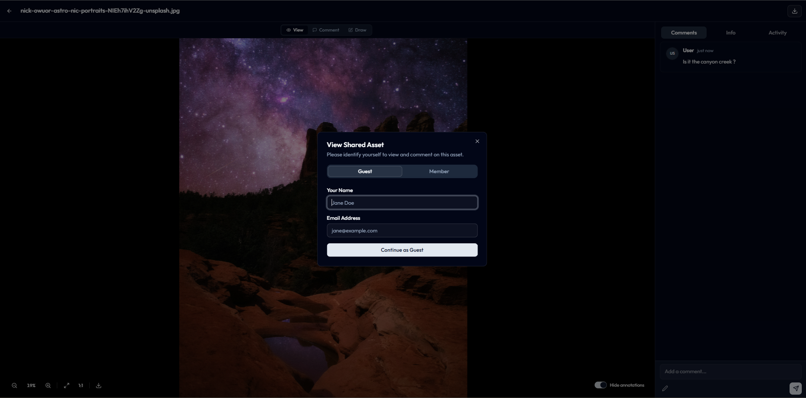
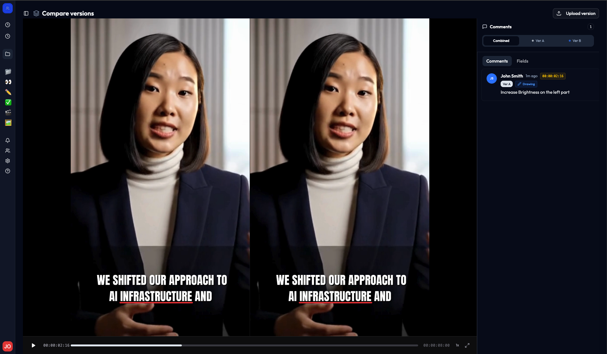
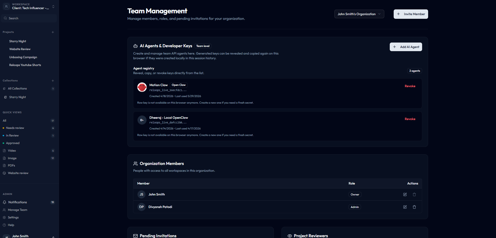
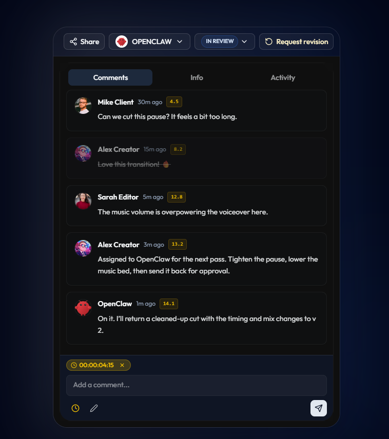

<p align="center">
  <picture>
    
  </picture>
</p>

<p align="center">
<a href="https://opensource.org/license/agpl-v3">
  
</a>
<a href="https://github.com/Reloops-App/reloops/graphs/traffic">
  
</a>
</p>

<h3 align="center"><strong><a href="docs/SETUP.md">NEW: run the open-source Reloops DAM locally in minutes</a></strong></h3>
<div align="center">
  <strong>
  <h2>Your open-source creative asset workspace for teams and AI agents</h2><br />
  Reloops: An alternative to Frame.io, Brandfolder, Bynder, Canto, Dropbox Replay, Ziflow, Filestage, Google Drive, Airtable, and internal DAM tools.<br /><br />
  </strong>
  Reloops offers everything you need to organize creative assets,<br />generate AI descriptions and tags, manage versions, collect approvals, share collections, and let agents work inside your media library.
</div>

<div class="flex" align="center">
  <br />
  <strong>DAM</strong>
  &nbsp;·&nbsp;
  <strong>AI Metadata</strong>
  &nbsp;·&nbsp;
  <strong>Search</strong>
  &nbsp;·&nbsp;
  <strong>Collections</strong>
  &nbsp;·&nbsp;
  <strong>Review</strong>
  &nbsp;·&nbsp;
  <strong>Approvals</strong>
  &nbsp;·&nbsp;
  <strong>Share Links</strong>
  &nbsp;·&nbsp;
  <strong>Agent API</strong>
</div>

<p align="center">
  <br />
  <a href="docs/SETUP.md" rel="dofollow"><strong>Start locally »</strong></a>
  &nbsp;·&nbsp;
  <a href="#intro" rel="dofollow"><strong>See what Reloops does »</strong></a>
  <br />
  <br />
  <a href="https://discord.gg/sas5PUPqN" rel="dofollow">
    
  </a>
  <br />
</p>

<p align="center">
  <a href="docs/SETUP.md">Quick Start</a>
  ·
  <a href="https://discord.gg/sas5PUPqN">Discord</a>
  ·
  <a href="docs/openclaw-reloops-api.md">OpenClaw API Skill</a>
  ·
  <a href="#features">Features</a>
  ·
  <a href="#alternative-to">Alternative To</a>
  ·
  <a href="#tech-stack">Tech Stack</a><br />
</p>
<p align="center">
  <a href="#agent-ready-dam">Agent-ready DAM</a>
  ·
  <a href="#self-hosted-oss">Self-hosted OSS</a>
  ·
  <a href="#license">License</a>
</p>

<br /><br />

## 🔌 See the leading Reloops features

<p align="center">
  
</p>

## ✨ Features

### 🔎 Find any asset instantly

Search across folders, tags, metadata, status, people, smart descriptions, dates, formats, and version stacks from one focused DAM surface.

<p align="center">
  
</p>

### ✅ Move creative work from review to approved

Run campaigns through a visual workflow board with upload, folders, filters, bulk selection, review states, assignees, and progress tracking.

<p align="center">
  
</p>

### 🤖 Let AI write searchable metadata

Reloops analyzes creative assets and generates useful descriptions and tags, so teams and agents can find the right media without manual cataloging.

<p align="center">
  
</p>

### 🌌 Publish client-ready collections

Turn selected assets into polished collections with download access, search, creator context, and a focused browsing experience.

<p align="center">
  
</p>

### 🔗 Share work without losing control

Create locked share links with expiration, download permissions, comment permissions, and collection-level access rules.

<p align="center">
  
</p>

### 💬 Collect guest feedback without onboarding

External reviewers can identify themselves, view shared assets, leave comments, and participate in review without joining the whole workspace.

<p align="center">
  
</p>

### 🎬 Compare versions side by side

Review old and new cuts together, keep timestamped comments attached to the right version, and upload the next pass from the same screen.

<p align="center">
  
</p>

### 🔑 Invite agents into the DAM

Create developer keys for OpenClaw, OpenAI, Claude, Gemini, Zapier, n8n, Replicate, Runway, and custom agents so automation can operate inside the asset system.

<p align="center">
  
</p>

### 👥 Manage teammates, reviewers, and agents

Keep organization members, roles, pending invites, project reviewers, and API-key agents in one admin workspace.

<p align="center">
  
</p>

### 🧠 Assign review work to humans or agents

Keep the full decision thread on the asset, assign the next pass to an agent like OpenClaw, and let the agent reply beside the team.

<p align="center">
  
</p>

### 🔔 Keep every review event visible

Track feedback, mentions, file updates, review activity, and AI metadata jobs from one notification center.

<p align="center">
  
</p>

# Intro

- 🗂️ Organize every campaign asset in a self-hosted creative DAM.
- 🔎 Search across folders, tags, metadata, statuses, people, dates, formats, and version stacks.
- 🤖 Use AI to generate smart descriptions and tags for images, videos, screenshots, and other creative assets.
- ✅ Move assets through project workflows from needs review to approved.
- 💬 Manage versions, comments, assignments, reviewers, approvals, share links, and guest feedback.
- 🧠 Assign review work to humans or agents and keep the full decision thread on the asset.
- 🌌 Build dynamic collections for campaigns, clients, teams, launches, and reusable asset groups.
- 👥 Invite team members to collaborate, comment, review, and approve assets.
- 🔌 Let AI agents and workflow tools create projects, fetch assets, comment, enrich metadata, and manage shares.
- ⚡ Perfect for automation with platforms like n8n, Make, Zapier, OpenClaw, and custom agents.

## 🔁 Alternative To

Reloops is a DAM-first product. Review and approval are built in because creative assets do not stop at storage.

| If you are using... | Reloops helps you replace or extend it with... |
|---------------------|-----------------------------------------------|
| Brandfolder, Bynder, Canto | Self-hosted creative DAM, collections, metadata, search, and asset history |
| Google Drive, Dropbox, Notion, Airtable | Purpose-built asset workspaces instead of folders, rows, and scattered comments |
| Frame.io, Dropbox Replay, Wipster | Review, comments, version stacks, approvals, and share links inside the DAM |
| Ziflow, Filestage, ReviewStudio | Structured creative feedback without a heavyweight enterprise approval suite |
| Zapier, n8n, Make, custom agents | Controlled API actors that can participate directly in asset operations |
| Internal DAM tools | Auth, storage, asset views, review UI, share links, API keys, and local workers already wired together |

## 🤖 Agent-ready DAM

- 🔑 API-key actors can operate inside organization workspaces.
- 👥 Human teammates, reviewers, and API-key agents can all be assigned asset work.
- 💬 Agents can receive review assignments and reply in the same comment thread as the team.
- 🗂️ Agents can list and create workspaces and projects.
- 🔌 Agents can fetch assets, patch asset status, create comments, and manage share links.
- 🧩 OpenClaw can use the included [`openclaw-reloops-api`](skills/openclaw-reloops-api/SKILL.md) skill; see the [OpenClaw API Skill guide](docs/openclaw-reloops-api.md).
- 🤖 The local asset intelligence worker uses AI to generate smart descriptions and tags for assets.
- 🔁 Generated media can flow back into the same library, collection, review, and approval loop.

## 🧱 Tech Stack

- 📦 Pnpm workspaces
- ⚛️ Vite + React + TypeScript
- 🟢 Supabase Auth, Postgres, Storage, RLS, and Edge Functions
- 🤖 Node asset intelligence worker
- 🔑 API-key agent layer
- 🐳 Docker for local Supabase services

## 🚀 Quick Start

Start the full local OSS stack with Docker:

```bash
cp .env.example .env
docker compose up --build
```

Then open `http://127.0.0.1:6173`. For manual pnpm setup and environment details, see the [Local Setup Guide](docs/SETUP.md).

## 🤝 Contributing

We welcome contributions! Check out the GitHub issues to find ways to help improve Reloops.

## 🏠 Self-hosted OSS

This repository is the open-source, self-hosted version of Reloops.

* ✅ Included in OSS:
  - Supabase Auth, Postgres, Storage, and Edge Functions
  - Workspaces, teams, projects, folders, assets, versions, comments, reviews, assignments, and notifications
  - DAM search, collections, metadata filtering, AI-generated smart descriptions and tags, share links, and guest comments
  - API-key agent endpoints for controlled automation inside workspaces
  - Local asset intelligence worker with DB queue polling
  - Local-first setup for running the full product on your machine or own infrastructure

* ⚠️ Not included in this OSS package:
  - Hosted billing and managed subscription infrastructure
  - Hosted cloud storage integrations beyond local Supabase Storage defaults
  - Hosted workers, QStash, Cloudflare Workers, and commercial deployment infrastructure
  - Managed analytics and managed screenshot capture
  - Managed email delivery; local OSS includes notification data/preferences and local invite handling, but production email delivery is expected to be wired by the self-hosting team

* 🗄️ Storage and capture model:
  - Uploads use Supabase Storage.
  - Website review works with uploaded or captured screenshots.
  - Asset intelligence runs locally through the worker to generate smart descriptions and tags unless you connect your own production worker setup.

## 📄 License

This repository's source code is available under the [AGPL-3.0 license](LICENSE)
