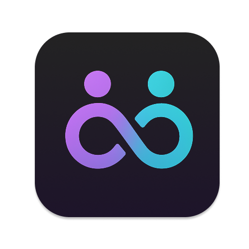
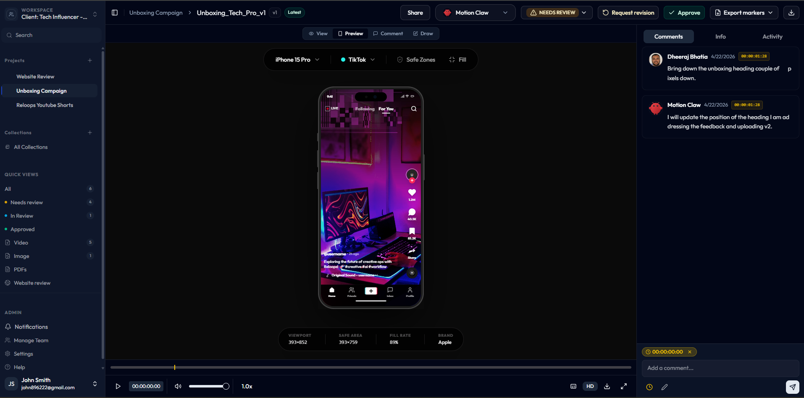
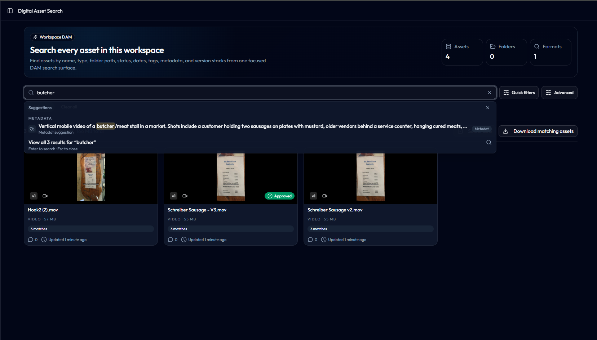
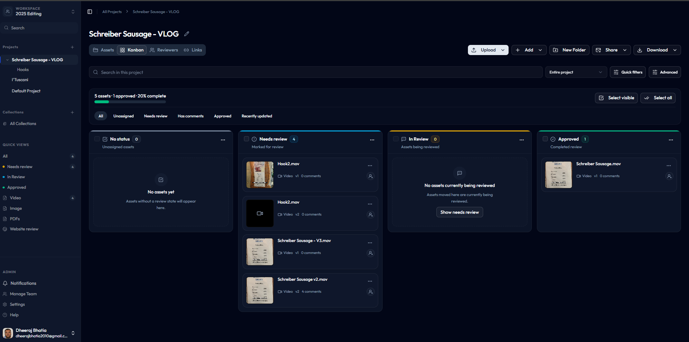
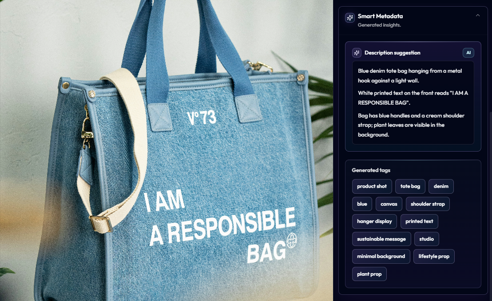
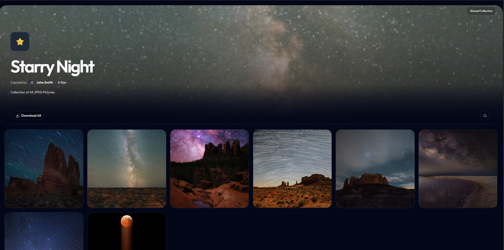
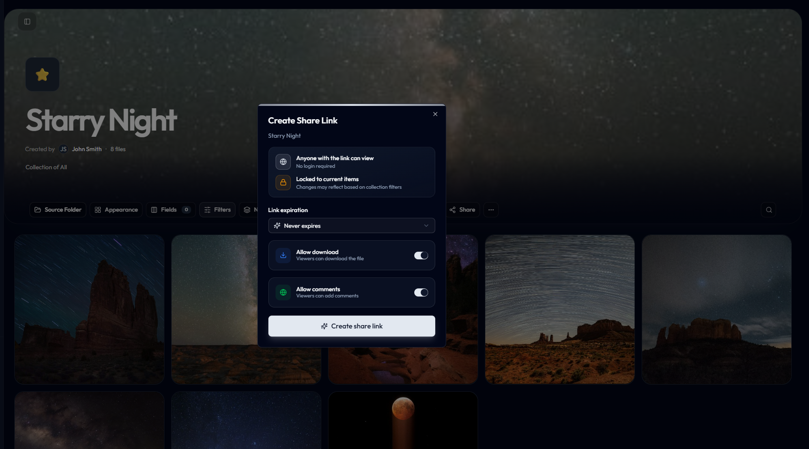
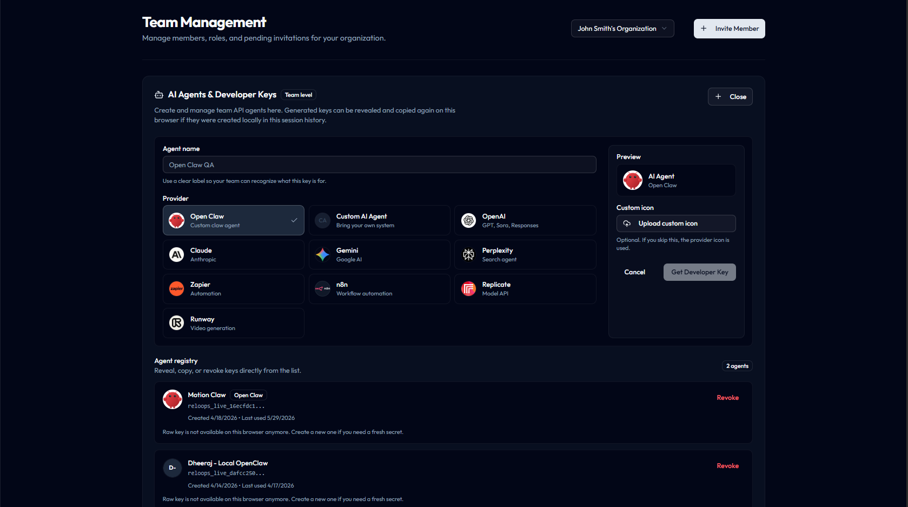
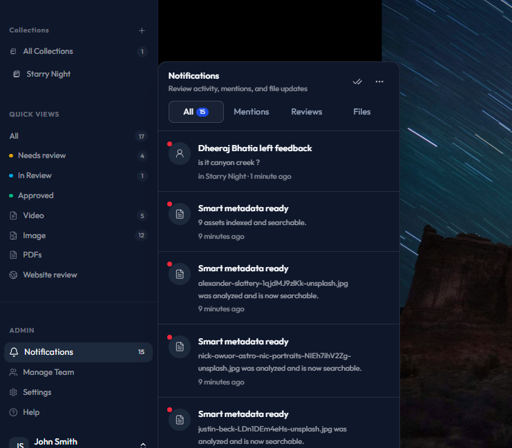

  <picture>
    
  </picture>

<h3 align="center"><strong><a href="docs/SETUP.md">NEW: run the open-source Reloops DAM locally in minutes</a></strong></h3>

  <strong>
  <h2>🎨 Open-source creative asset workspace for teams and AI agents 🤖</h2> 
  Reloops: An alternative to Brandfolder, Bynder, Canto, Frame.io, Dropbox Replay, Ziflow, Filestage, and internal DAM tools.  
  </strong>
  Reloops gives you everything you need to organize creative assets, manage versions, collect approvals, share collections, and use AI to generate searchable descriptions and tags.

   
  <strong>DAM</strong>
  &nbsp;·&nbsp;
  <strong>Collections</strong>
  &nbsp;·&nbsp;
  <strong>AI Tags</strong>
  &nbsp;·&nbsp;
  <strong>Search</strong>
  &nbsp;·&nbsp;
  <strong>Versions</strong>
  &nbsp;·&nbsp;
  <strong>Approvals</strong>
  &nbsp;·&nbsp;
  <strong>Share Links</strong>
  &nbsp;·&nbsp;
  <strong>Agent API</strong>

   
  <a href="docs/SETUP.md" rel="dofollow"><strong>Start locally »</strong></a>
   

   
  <a href="#intro" rel="dofollow"><strong>See what Reloops does »</strong></a>
   

  <a href="docs/SETUP.md">Quick Start</a>
  ·
  <a href="#features">Features</a>
  ·
  <a href="#a-modern-alternative-to-closed-dam-and-creative-review-tools">Alternative To</a>
  ·
  <a href="#tech-stack">Tech Stack</a> 

  <a href="#agent-ready-dam">Agent-ready DAM</a>
  ·
  <a href="#self-hosted-oss">Self-hosted OSS</a>
  ·
  <a href="#license">License</a>

  

## A modern alternative to closed DAM and creative review tools

Reloops is a DAM-first product. Review and approval are built in because assets do not stop at storage.

| If you are using... | Reloops helps you replace or extend it with... |
|---------------------|-----------------------------------------------|
| Brandfolder, Bynder, Canto | A self-hosted creative DAM for projects, collections, metadata, search, and asset history |
| Google Drive, Dropbox, Notion, Airtable | A purpose-built asset workspace instead of folders, rows, and scattered comments |
| Frame.io, Dropbox Replay, Wipster | Asset review, comments, version stacks, approvals, and share links inside the DAM |
| Ziflow, Filestage, ReviewStudio | Structured creative feedback without a heavyweight enterprise approval suite |
| Zapier, n8n, Make, custom agents | Controlled API actors that can create projects, fetch assets, comment, enrich metadata, and manage shares |
| A custom internal DAM | Auth, storage, asset views, review UI, share links, API keys, and local workers already wired together |

## Built for real collaboration

| Collaboration need | What Reloops gives you |
|--------------------|------------------------|
| Team access | Organization members, workspace roles, project reviewers, and invite flows |
| Clear ownership | Asset assignees for humans and API-key agents |
| Review routing | Review requested, approved, changes requested, overdue, mention, reply, and guest feedback events |
| Notification control | In-app notifications plus email-ready notification preferences by event type |
| Guest participation | External reviewers can identify themselves, comment, and leave feedback from share links |

## 🔌 See the leading Reloops features

  

## ✨ Features

### Find any asset instantly

Search across folders, tags, metadata, status, people, smart descriptions, dates, formats, and version stacks from one focused DAM surface.

  

### Keep every campaign moving

Move assets from needs review to approved with project-level workflow boards, progress indicators, filters, bulk selection, upload, share, and download actions.

  

### Let AI describe and tag every asset

Reloops can analyze creative assets and generate smart descriptions and tags, turning raw media into searchable DAM metadata your team and agents can actually use.

  

### Publish collections clients can actually use

Package campaign assets into branded collections that can be browsed, searched, downloaded, and shared without exposing the whole workspace.

  

### Share review links without losing control

Create controlled asset or collection links with download permissions, comments, locked item sets, and expiration settings.

  

### Invite agents into the DAM

Create developer keys for OpenClaw, OpenAI, Claude, Gemini, Zapier, n8n, Replicate, Runway, and custom agents so automation can operate inside your creative asset system.

  

### Coordinate teams, reviewers, and assignments

Manage organization members, project reviewers, asset assignees, guest feedback, mentions, and review activity from the same workspace. Reloops keeps human responsibility attached to the asset, not buried in chat.

  

# Intro

- Organize every campaign asset in a self-hosted creative DAM.
- Move assets through project workflows from needs review to approved.
- Search by name, type, folder path, status, people, dates, usage fields, AI-generated descriptions, and AI-generated tags.
- Manage versions, approvals, share links, and guest review feedback without losing asset history.
- Build dynamic collections for campaigns, clients, teams, launches, and reusable asset groups.
- Track review activity, file updates, mentions, and AI metadata jobs from a notification center.
- Manage team members, reviewers, roles, asset assignees, and guest feedback in the same workspace.
- Use in-app notifications and email-ready notification preferences for review requests, approvals, changes requested, mentions, replies, and guest feedback.
- Invite humans and agents into the same creative workspace.
- Perfect for automation with platforms like n8n, Make, Zapier, OpenClaw, custom agents, and internal workflows.

## Agent-ready DAM

- API-key actors can operate inside organization workspaces.
- Human teammates, reviewers, and API-key agents can all be assigned asset work.
- Agents can list and create workspaces and projects.
- Agents can fetch assets, patch asset status, create comments, and manage share links.
- The local asset intelligence worker uses AI to generate smart descriptions and tags for assets.
- Generated media can flow back into the same library, collection, review, and approval loop.

## Tech Stack

- **Monorepo:** pnpm workspaces
- **Frontend:** Vite, React, TypeScript, Tailwind-style component UI
- **Backend:** Supabase Auth, Postgres, Storage, Row Level Security, and Edge Functions
- **Data model:** organizations, workspaces, projects, assets, folders, collections, share links, comments, notifications, API keys, and asset intelligence jobs
- **Agent layer:** scoped API-key actors for external tools, workflow automation, and AI agents
- **AI metadata:** local Node asset intelligence worker that generates smart descriptions and smart tags with DB queue polling
- **Local runtime:** Docker-powered Supabase stack with web app, Edge Functions, and worker processes

## Quick Start

To have the project up and running, please follow the [Local Setup Guide](docs/SETUP.md).

## Self-hosted OSS

This repository is the open-source, self-hosted version of Reloops.

* Included in OSS:
  - Supabase Auth, Postgres, Storage, and Edge Functions
  - Workspaces, teams, projects, folders, assets, versions, comments, reviews, assignments, and notifications
  - DAM search, collections, metadata filtering, AI-generated smart descriptions and tags, share links, and guest comments
  - API-key agent endpoints for controlled automation inside workspaces
  - Local asset intelligence worker with DB queue polling
  - Local-first setup for running the full product on your machine or own infrastructure

* Storage and capture model:
  - Uploads use Supabase Storage.
  - Website review works with uploaded or captured screenshots.
  - Asset intelligence runs locally through the worker to generate smart descriptions and tags unless you connect your own production worker setup.

## License

This repository's source code is available under the [AGPL-3.0 license](LICENSE).
